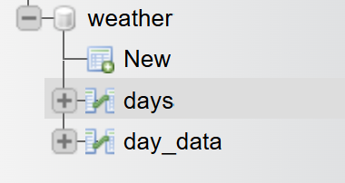
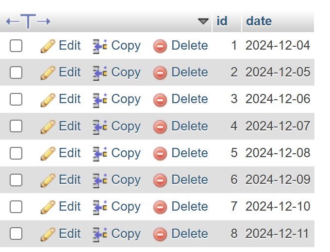
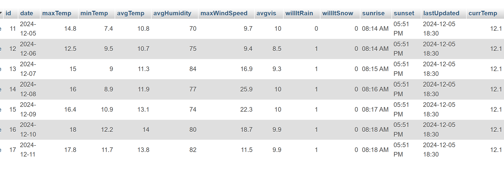

# **Hava Durumu Projesi**

Bu proje, **Java Swing** kullanılarak geliştirilmiş ve NetBeans IDE üzerinde çalıştırılmıştır. **Weather API** ([https://www.weatherapi.com/](https://www.weatherapi.com/)) kullanılarak İzmir’in hava durumu verileri alınır. Alınan veriler **MySQL** veritabanında saklanır ve **Swing arayüzü** üzerinden kullanıcıya sunulur. Kullanıcı, bu verileri kolayca görüntüleyebilir, silebilir ve önümüzdeki 7 günün hava tahminlerini görüntüleyebilir.

---

## **Özellikler**
- **Weather API** üzerinden alınan veriler:
  - Tarih (Date)
  - Maksimum sıcaklık (Maximum Temperature)
  - Minimum sıcaklık (Minimum Temperature)
  - Ortalama sıcaklık (Average Temperature)
  - Ortalama nem (Average Humidity)
  - Maksimum rüzgar hızı (Maximum Wind Speed)
  - Ortalama görüş mesafesi (Average Visibility)
  - Yağmur ihtimali (Rain Possibility)
  - Kar ihtimali (Snow Possibility)
  - Gün doğumu saati (Sunrise Time)
  - Gün batımı saati (Sunset Time)
  - Son güncelleme zamanı (Last Update Time)
  - Anlık sıcaklık (Current Temperature)
  - Anlık durum (Current State)
  - Anlık rüzgar (Current Wind)
  - Anlık nem (Current Humidity)
  - Hissedilen sıcaklık (Current Felt Temperature)
  - UV ışını değeri (Current UV Light)

- **Veritabanı İşlemleri**:
  - Verilerin **MySQL** veritabanına kaydedilmesi.
  - Swing arayüzü üzerinden verilerin görüntülenmesi ve yönetimi.
  - 7 günlük hava durumu tahmin verilerinin API’dan çekilmesi.

---

## **Kullanılan Teknolojiler ve Kütüphaneler**
- **Programlama Dili**: Java
- **Görsel Arayüz**: Swing
- **Veritabanı**: MySQL (XAMPP ile)
- **API İşlemleri**: GSON (JSON işlemleri için)
- **Bağlantı Kütüphanesi**: MySQL Connector

---

## **Kurulum ve Çalıştırma Adımları**
1. **XAMPP’i İndirin ve MySQL’i Başlatın**:
   - XAMPP kurulumu yaparak MySQL sunucusunu çalıştırın.

2. **Veritabanı Yapısını Oluşturun**:
   - Proje dosyalarında belirtilen yapıya uygun bir şekilde MySQL üzerinde tabloları oluşturun.
     - (Gerekli tablo yapıları için proje dosyasına bakınız.)

3. **Projeyi Çalıştırın**:
   - NetBeans ile projeyi açın.
   - **Ana Ekran** (Main Screen) kısmından projeyi çalıştırın.

---

## **Ekran Görüntüleri**
### **Ana Ekran**

### **7 Günlük Tahmin**

### **Veri Görüntüleme (1)**

### **Veri Görüntüleme (2)**

### **Ekran Verisi(datalar yokken)**

### **Ekran Verisi(datalar varken)**

---

## **Gereksinimler**
- **Java JDK**: Minimum 8
- **NetBeans IDE**
- **XAMPP**: MySQL sunucusu için
- **Weather API Anahtarı**: [WeatherAPI’den alınabilir](https://www.weatherapi.com/)

---

## **Geliştirici Notları**
- Projenin çalışması için API anahtarı gereklidir. Bu anahtarı **WeatherAPI**’den ücretsiz olarak temin edebilirsiniz.
- Veritabanı yapılandırması sırasında hata yaşamamak için tabloların adlarını ve veri tiplerini dikkatlice kontrol edin.

---
